# `<APP_NAME>` — Database Schema

MySQL, `spring.jpa.hibernate.ddl-auto=update` — entity annotations are the schema source of
truth, no Flyway (per project convention). This document is the spec those entities get written
against.

**PK type rule** (extends the stub's existing `User`=UUID / `AuthToken`=BIGINT split): an entity
gets a **UUID** primary key if it is addressed directly via its own `/resource/{id}` endpoint and
returned as a first-class identity to a non-admin client (enumeration would let one customer
probe another's resources). Everything else — child rows always reached through a parent, or
admin-only config tables — gets a plain **BIGINT AUTO_INCREMENT**, same reasoning the stub uses
for `AuthToken`. Table-by-table calls are marked accordingly.

`file_id` columns reference `storage-service`'s SQLite `metadata.db`, a **separate database** in
a separate app (per project design) — these are plain UUID columns with **no FK constraint**,
resolved at read time via `StorageClient`, exactly like the stub's storage integration already
works.

---

## 1. Entity-Relationship Diagram

```mermaid
erDiagram
    USERS ||--o{ AUTH_TOKENS : "has"
    USERS ||--o{ ADDRESSES : "has"
    USERS ||--o| CARTS : "owns"
    USERS ||--o{ RENTAL_ORDERS : "places (customer)"
    USERS ||--o{ RENTAL_ORDERS : "confirms (admin)"
    USERS ||--o{ QUOTATIONS : "created for (customer)"
    USERS ||--o{ QUOTATIONS : "created by (admin)"

    PRODUCTS ||--o{ PRODUCT_IMAGES : "has"
    PRODUCTS ||--o{ PRODUCT_VARIANTS : "has"
    ATTRIBUTE_TYPES ||--o{ ATTRIBUTE_VALUES : "has"
    PRODUCT_VARIANTS }o--o{ ATTRIBUTE_VALUES : "via VARIANT_ATTRIBUTE_VALUES"

    PRICELISTS ||--o{ PRICELIST_ITEMS : "has"
    PRODUCT_VARIANTS ||--o{ PRICELIST_ITEMS : "priced by"

    CARTS ||--o{ CART_ITEMS : "contains"
    PRODUCT_VARIANTS ||--o{ CART_ITEMS : "referenced by"
    RENTAL_PERIODS ||--o{ CART_ITEMS : "optional template"

    QUOTATION_TEMPLATES ||--o{ QUOTATIONS : "used by"
    QUOTATIONS ||--o{ QUOTATION_LINES : "has"
    PRODUCT_VARIANTS ||--o{ QUOTATION_LINES : "referenced by"
    QUOTATIONS ||--o| RENTAL_ORDERS : "confirmed into"

    RENTAL_ORDERS ||--o{ RENTAL_ORDER_LINES : "has"
    PRODUCT_VARIANTS ||--o{ RENTAL_ORDER_LINES : "referenced by"
    RENTAL_PERIODS ||--o{ RENTAL_ORDER_LINES : "optional template"
    ADDRESSES ||--o{ RENTAL_ORDERS : "delivery address for"

    RENTAL_ORDERS ||--o{ PAYMENTS : "has"
    RENTAL_ORDERS ||--o| SECURITY_DEPOSITS : "has"
    SECURITY_DEPOSITS ||--o{ DEPOSIT_TRANSACTIONS : "has"
    RENTAL_ORDERS ||--o| PENALTIES : "may have"
    RENTAL_ORDERS ||--o| PICKUPS : "has"
    RENTAL_ORDERS ||--o| RETURNS : "has"
    RETURNS ||--o{ DAMAGE_REPORTS : "may have"
    DAMAGE_REPORTS ||--o{ DAMAGE_REPORT_PHOTOS : "has"
    RENTAL_ORDERS ||--o{ INVOICES : "has"

    USERS {
        UUID id PK
        string email UK
        string password_hash
        string role
        string auth_provider
        boolean is_verified
        int token_version
        UUID profile_image_file_id
    }
    AUTH_TOKENS {
        bigint id PK
        string token_hash UK
        string token_type
        UUID user_id FK
        datetime expiry_date
        boolean used
    }
    ADDRESSES {
        UUID id PK
        UUID user_id FK
        string label
        string line1
        string city
        string postal_code
        boolean is_default
    }
    PRODUCTS {
        UUID id PK
        string name
        string category
        decimal base_price
        decimal security_deposit_amount
        boolean active
    }
    PRODUCT_IMAGES {
        bigint id PK
        UUID product_id FK
        UUID file_id
        int sort_order
    }
    PRODUCT_VARIANTS {
        UUID id PK
        UUID product_id FK
        string sku
        int total_quantity
        boolean active
    }
    ATTRIBUTE_TYPES {
        bigint id PK
        string name UK
    }
    ATTRIBUTE_VALUES {
        bigint id PK
        bigint attribute_type_id FK
        string value
    }
    VARIANT_ATTRIBUTE_VALUES {
        UUID product_variant_id PK_FK
        bigint attribute_value_id PK_FK
    }
    PRICELISTS {
        bigint id PK
        string name
        boolean is_default
        date valid_from
        date valid_to
        boolean active
        datetime created_at
    }
    PRICELIST_ITEMS {
        bigint id PK
        bigint pricelist_id FK
        UUID product_variant_id FK
        string duration_unit
        decimal unit_price
    }
    RENTAL_PERIODS {
        bigint id PK
        string name
        int duration_value
        string duration_unit
    }
    QUOTATION_TEMPLATES {
        bigint id PK
        string name
        text header
        text footer
        text terms
    }
    QUOTATIONS {
        UUID id PK
        UUID customer_id FK
        bigint quotation_template_id FK
        UUID created_by FK
        string status
        date valid_until
    }
    QUOTATION_LINES {
        bigint id PK
        UUID quotation_id FK
        UUID product_variant_id FK
        int quantity
        date start_date
        date end_date
        decimal unit_price
        decimal line_total
    }
    CARTS {
        UUID id PK
        UUID user_id FK "unique"
    }
    CART_ITEMS {
        bigint id PK
        UUID cart_id FK
        UUID product_variant_id FK
        bigint rental_period_id FK "nullable"
        int quantity
        date start_date
        date end_date
    }
    RENTAL_ORDERS {
        UUID id PK
        UUID customer_id FK
        UUID quotation_id FK "nullable"
        string status
        string fulfillment_method
        UUID delivery_address_id FK "nullable"
        decimal subtotal_amount
        decimal deposit_amount
        decimal total_amount
        UUID confirmed_by FK "nullable"
        datetime confirmed_at
    }
    RENTAL_ORDER_LINES {
        bigint id PK
        UUID order_id FK
        UUID product_variant_id FK
        bigint rental_period_id FK "nullable"
        int quantity
        date start_date
        date end_date
        decimal unit_price
        decimal line_total
    }
    PAYMENTS {
        bigint id PK
        UUID order_id FK
        string razorpay_order_id
        string razorpay_payment_id
        string type
        decimal amount
        string status
    }
    SECURITY_DEPOSITS {
        bigint id PK
        UUID order_id FK "unique"
        decimal amount
        string status
    }
    DEPOSIT_TRANSACTIONS {
        bigint id PK
        bigint deposit_id FK
        string type
        decimal amount
        string reason
        string razorpay_refund_id
    }
    PENALTIES {
        bigint id PK
        UUID order_id FK "unique"
        int days_late
        decimal daily_rate_percentage
        decimal calculated_amount
        decimal capped_amount
        decimal deducted_from_deposit
        decimal outstanding_amount
    }
    PICKUPS {
        bigint id PK
        UUID order_id FK "unique"
        date scheduled_date
        string status
        UUID confirmed_by FK "nullable"
    }
    RETURNS {
        bigint id PK
        UUID order_id FK "unique"
        date scheduled_date
        datetime actual_return_date
        string status
        boolean damage_reported
        boolean missing_accessories
        UUID inspected_by FK "nullable"
    }
    DAMAGE_REPORTS {
        bigint id PK
        bigint return_id FK
        text description
        decimal estimated_cost
        string repair_status
    }
    DAMAGE_REPORT_PHOTOS {
        bigint id PK
        bigint damage_report_id FK
        UUID file_id
    }
    INVOICES {
        UUID id PK
        UUID order_id FK
        string type
        UUID file_id
        decimal amount
        datetime issued_at
    }
    RENTAL_SETTINGS {
        bigint id PK "singleton, always 1"
        decimal daily_late_fee_percentage
        decimal max_late_fee_multiplier
        int grace_period_days
        int default_pickup_window_days
        int default_return_window_days
    }
```

---

## 2. Table Definitions

### 2.1 Identity & Access

#### `users` — existing, unchanged except one new column
| Column | Type | Constraints |
|---|---|---|
| id | UUID | PK |
| email | VARCHAR(120) | NOT NULL, UNIQUE, indexed |
| password_hash | VARCHAR(255) | nullable (Google-only accounts have none) |
| first_name | VARCHAR(50) | |
| last_name | VARCHAR(50) | |
| role | VARCHAR(20) | NOT NULL — `ADMIN` \| `CUSTOMER` |
| auth_provider | VARCHAR(20) | NOT NULL — `MANUAL` \| `GOOGLE` |
| google_id | VARCHAR(100) | UNIQUE, nullable, indexed |
| is_verified | BOOLEAN | NOT NULL, default false |
| token_version | INT | NOT NULL, default 0 |
| **profile_image_file_id** | UUID | nullable — **new**, storage-service ref, no FK |
| created_at | DATETIME | NOT NULL |
| updated_at | DATETIME | NOT NULL |

#### `auth_tokens` — existing, unchanged
| Column | Type | Constraints |
|---|---|---|
| id | BIGINT | PK, auto-increment |
| token_hash | VARCHAR(255) | NOT NULL, UNIQUE, indexed |
| token_type | VARCHAR(20) | NOT NULL — `VERIFICATION` \| `PASSWORD_RESET` |
| user_id | UUID | FK → `users.id`, ON DELETE CASCADE, NOT NULL, indexed |
| expiry_date | DATETIME | NOT NULL |
| used | BOOLEAN | NOT NULL, default false |
| created_at | DATETIME | NOT NULL |

#### `addresses` — new
| Column | Type | Constraints |
|---|---|---|
| id | UUID | PK |
| user_id | UUID | FK → `users.id`, ON DELETE CASCADE, NOT NULL, indexed |
| label | VARCHAR(50) | e.g. "Home", "Office" |
| line1 | VARCHAR(255) | NOT NULL |
| line2 | VARCHAR(255) | nullable |
| city | VARCHAR(100) | NOT NULL |
| state | VARCHAR(100) | NOT NULL |
| postal_code | VARCHAR(20) | NOT NULL |
| country | VARCHAR(100) | NOT NULL |
| is_default | BOOLEAN | NOT NULL, default false — service layer enforces only one default per user |
| created_at | DATETIME | NOT NULL |
| updated_at | DATETIME | NOT NULL |

---

### 2.2 Catalog

#### `attribute_types` — new (Brand, Manufacturer, Color, Size — PDF §5)
| Column | Type | Constraints |
|---|---|---|
| id | BIGINT | PK, auto-increment |
| name | VARCHAR(50) | NOT NULL, UNIQUE |
| created_at | DATETIME | NOT NULL |

#### `attribute_values` — new
| Column | Type | Constraints |
|---|---|---|
| id | BIGINT | PK, auto-increment |
| attribute_type_id | BIGINT | FK → `attribute_types.id`, NOT NULL, indexed |
| value | VARCHAR(100) | NOT NULL |
| created_at | DATETIME | NOT NULL |
| | | UNIQUE(`attribute_type_id`, `value`) |

#### `products` — new
| Column | Type | Constraints |
|---|---|---|
| id | UUID | PK |
| name | VARCHAR(150) | NOT NULL, indexed |
| description | TEXT | |
| category | VARCHAR(100) | indexed |
| base_price | DECIMAL(12,2) | NOT NULL — used as the late-fee calculation base (PRD §7) |
| security_deposit_amount | DECIMAL(12,2) | NOT NULL — fixed deposit, per product (PRD Q7) |
| active | BOOLEAN | NOT NULL, default true — soft-delete flag, never hard-delete a product referenced by past orders |
| created_at | DATETIME | NOT NULL |
| updated_at | DATETIME | NOT NULL |

#### `product_images` — new
| Column | Type | Constraints |
|---|---|---|
| id | BIGINT | PK, auto-increment |
| product_id | UUID | FK → `products.id`, ON DELETE CASCADE, NOT NULL, indexed |
| file_id | UUID | NOT NULL — storage-service ref, no FK |
| sort_order | INT | NOT NULL, default 0 |
| created_at | DATETIME | NOT NULL |

#### `product_variants` — new
| Column | Type | Constraints |
|---|---|---|
| id | UUID | PK |
| product_id | UUID | FK → `products.id`, ON DELETE CASCADE, NOT NULL, indexed |
| sku | VARCHAR(50) | nullable, UNIQUE |
| total_quantity | INT | NOT NULL, `CHECK (total_quantity >= 0)` — stock count for this exact variant (PRD Q4) |
| active | BOOLEAN | NOT NULL, default true |
| created_at | DATETIME | NOT NULL |
| updated_at | DATETIME | NOT NULL |

A product with no configured attribute axes gets exactly one variant row (the implicit default),
so every order/cart/pricing reference is always to a `product_variant_id`, never a bare
`product_id` — one shape for both "simple" and "variant" products.

#### `variant_attribute_values` — new (join table)
| Column | Type | Constraints |
|---|---|---|
| product_variant_id | UUID | FK → `product_variants.id`, ON DELETE CASCADE, PK (composite) |
| attribute_value_id | BIGINT | FK → `attribute_values.id`, PK (composite) |

---

### 2.3 Pricing

#### `pricelists` — new
| Column | Type | Constraints |
|---|---|---|
| id | BIGINT | PK, auto-increment |
| name | VARCHAR(100) | NOT NULL |
| is_default | BOOLEAN | NOT NULL, default false — exactly one row may have this true; service-layer invariant, not a DB constraint (MySQL has no partial-unique-index) |
| valid_from | DATE | nullable = unbounded start |
| valid_to | DATE | nullable = unbounded end |
| active | BOOLEAN | NOT NULL, default true |
| created_at | DATETIME | NOT NULL — **conflict-resolution key**: oldest `created_at` wins when multiple pricelists match (PRD Q8) |

#### `pricelist_items` — new
| Column | Type | Constraints |
|---|---|---|
| id | BIGINT | PK, auto-increment |
| pricelist_id | BIGINT | FK → `pricelists.id`, ON DELETE CASCADE, NOT NULL, indexed |
| product_variant_id | UUID | FK → `product_variants.id`, ON DELETE CASCADE, NOT NULL, indexed |
| duration_unit | VARCHAR(10) | NOT NULL — `HOUR` \| `DAY` \| `WEEK` \| `MONTH` |
| unit_price | DECIMAL(12,2) | NOT NULL |
| created_at | DATETIME | NOT NULL |
| | | UNIQUE(`pricelist_id`, `product_variant_id`, `duration_unit`) |

#### `rental_periods` — new (named duration templates, PRD §4/Q5)
| Column | Type | Constraints |
|---|---|---|
| id | BIGINT | PK, auto-increment |
| name | VARCHAR(50) | NOT NULL — e.g. "Weekend", "1 Week" |
| duration_value | INT | NOT NULL |
| duration_unit | VARCHAR(10) | NOT NULL — `HOUR` \| `DAY` \| `WEEK` \| `MONTH` |
| active | BOOLEAN | NOT NULL, default true |
| created_at | DATETIME | NOT NULL |

---

### 2.4 Quotations (in-store, admin-initiated)

#### `quotation_templates` — new
| Column | Type | Constraints |
|---|---|---|
| id | BIGINT | PK, auto-increment |
| name | VARCHAR(100) | NOT NULL |
| header | TEXT | |
| footer | TEXT | |
| terms | TEXT | |
| created_at | DATETIME | NOT NULL |
| updated_at | DATETIME | NOT NULL |

#### `quotations` — new
| Column | Type | Constraints |
|---|---|---|
| id | UUID | PK |
| customer_id | UUID | FK → `users.id`, NOT NULL, indexed |
| quotation_template_id | BIGINT | FK → `quotation_templates.id`, nullable |
| created_by | UUID | FK → `users.id` (admin), NOT NULL |
| status | VARCHAR(20) | NOT NULL — `DRAFT` \| `SENT` \| `CONFIRMED` \| `REJECTED` \| `EXPIRED` |
| valid_until | DATE | nullable |
| created_at | DATETIME | NOT NULL |
| updated_at | DATETIME | NOT NULL |

#### `quotation_lines` — new
| Column | Type | Constraints |
|---|---|---|
| id | BIGINT | PK, auto-increment |
| quotation_id | UUID | FK → `quotations.id`, ON DELETE CASCADE, NOT NULL, indexed |
| product_variant_id | UUID | FK → `product_variants.id`, NOT NULL |
| quantity | INT | NOT NULL, `CHECK (quantity > 0)` |
| start_date | DATE | NOT NULL |
| end_date | DATE | NOT NULL, `CHECK (end_date > start_date)` |
| unit_price | DECIMAL(12,2) | NOT NULL — snapshotted at quote time, not recomputed later |
| line_total | DECIMAL(12,2) | NOT NULL |

`rental_orders.quotation_id` (see §2.6) links a confirmed quotation to the order it produced.

---

### 2.5 Cart (portal self-service)

#### `carts` — new
| Column | Type | Constraints |
|---|---|---|
| id | UUID | PK |
| user_id | UUID | FK → `users.id`, ON DELETE CASCADE, NOT NULL, **UNIQUE** — one cart per customer |
| created_at | DATETIME | NOT NULL |
| updated_at | DATETIME | NOT NULL |

#### `cart_items` — new
| Column | Type | Constraints |
|---|---|---|
| id | BIGINT | PK, auto-increment |
| cart_id | UUID | FK → `carts.id`, ON DELETE CASCADE, NOT NULL, indexed |
| product_variant_id | UUID | FK → `product_variants.id`, NOT NULL |
| rental_period_id | BIGINT | FK → `rental_periods.id`, nullable — set if chosen via template, null if free-form dates (PRD Q5) |
| quantity | INT | NOT NULL, `CHECK (quantity > 0)` |
| start_date | DATE | NOT NULL |
| end_date | DATE | NOT NULL, `CHECK (end_date > start_date)` |
| created_at | DATETIME | NOT NULL |

---

### 2.6 Orders — the core lifecycle

#### `rental_orders` — new
| Column | Type | Constraints |
|---|---|---|
| id | UUID | PK |
| customer_id | UUID | FK → `users.id`, NOT NULL, indexed |
| quotation_id | UUID | FK → `quotations.id`, nullable — set only if this order originated from an in-store quotation |
| status | VARCHAR(30) | NOT NULL, indexed — see enum list §3; drives the state machine in SYSTEM_DESIGN §4 |
| fulfillment_method | VARCHAR(20) | NOT NULL — `DELIVERY` \| `STORE_PICKUP` |
| delivery_address_id | UUID | FK → `addresses.id`, nullable — required if `fulfillment_method = DELIVERY` (service-layer check) |
| subtotal_amount | DECIMAL(12,2) | NOT NULL — sum of line totals |
| deposit_amount | DECIMAL(12,2) | NOT NULL — sum of each line's product `security_deposit_amount × quantity` |
| total_amount | DECIMAL(12,2) | NOT NULL — subtotal + deposit, the amount charged via Razorpay |
| confirmed_by | UUID | FK → `users.id` (admin), nullable until confirmed |
| confirmed_at | DATETIME | nullable |
| created_at | DATETIME | NOT NULL |
| updated_at | DATETIME | NOT NULL |

#### `rental_order_lines` — new
| Column | Type | Constraints |
|---|---|---|
| id | BIGINT | PK, auto-increment |
| order_id | UUID | FK → `rental_orders.id`, ON DELETE CASCADE, NOT NULL, indexed |
| product_variant_id | UUID | FK → `product_variants.id`, NOT NULL, indexed — **indexed because availability/overlap queries filter on this** |
| rental_period_id | BIGINT | FK → `rental_periods.id`, nullable |
| quantity | INT | NOT NULL, `CHECK (quantity > 0)` |
| start_date | DATE | NOT NULL, indexed (composite with `product_variant_id` for overlap queries) |
| end_date | DATE | NOT NULL, `CHECK (end_date > start_date)` |
| unit_price | DECIMAL(12,2) | NOT NULL — snapshotted at confirmation, immune to later pricelist edits |
| line_total | DECIMAL(12,2) | NOT NULL |

---

### 2.7 Payments & Deposits

#### `payments` — new
| Column | Type | Constraints |
|---|---|---|
| id | BIGINT | PK, auto-increment |
| order_id | UUID | FK → `rental_orders.id`, NOT NULL, indexed |
| razorpay_order_id | VARCHAR(100) | NOT NULL, indexed |
| razorpay_payment_id | VARCHAR(100) | nullable until captured |
| razorpay_signature | VARCHAR(255) | nullable, stored for audit after webhook verification |
| type | VARCHAR(20) | NOT NULL — `ORDER_PAYMENT` \| `REFUND` |
| amount | DECIMAL(12,2) | NOT NULL |
| status | VARCHAR(20) | NOT NULL — `CREATED` \| `PAID` \| `FAILED` \| `REFUNDED` |
| created_at | DATETIME | NOT NULL |
| updated_at | DATETIME | NOT NULL |

#### `security_deposits` — new
| Column | Type | Constraints |
|---|---|---|
| id | BIGINT | PK, auto-increment |
| order_id | UUID | FK → `rental_orders.id`, NOT NULL, **UNIQUE** — one deposit per order |
| amount | DECIMAL(12,2) | NOT NULL — copied from `rental_orders.deposit_amount` at PAID time |
| status | VARCHAR(20) | NOT NULL — `HELD` \| `PARTIALLY_REFUNDED` \| `REFUNDED` \| `FORFEITED` |
| created_at | DATETIME | NOT NULL |
| updated_at | DATETIME | NOT NULL |

#### `deposit_transactions` — new (append-only ledger — PDF §2 "maintain complete deposit history")
| Column | Type | Constraints |
|---|---|---|
| id | BIGINT | PK, auto-increment |
| deposit_id | BIGINT | FK → `security_deposits.id`, ON DELETE CASCADE, NOT NULL, indexed |
| type | VARCHAR(20) | NOT NULL — `HOLD` \| `DEDUCTION` \| `REFUND` |
| amount | DECIMAL(12,2) | NOT NULL |
| reason | VARCHAR(255) | nullable — e.g. "Late return penalty", "On-time return" |
| razorpay_refund_id | VARCHAR(100) | nullable, set on `REFUND` rows |
| created_at | DATETIME | NOT NULL — never updated, never deleted |

No column on `security_deposits` is ever decremented directly — every change is a new
`deposit_transactions` row; `security_deposits.status` is a derived cache updated in the same
transaction, not the source of truth.

---

### 2.8 Late Fees

#### `penalties` — new
| Column | Type | Constraints |
|---|---|---|
| id | BIGINT | PK, auto-increment |
| order_id | UUID | FK → `rental_orders.id`, NOT NULL, **UNIQUE** |
| days_late | INT | NOT NULL, `CHECK (days_late >= 0)` |
| daily_rate_percentage | DECIMAL(5,4) | NOT NULL — snapshot of `rental_settings.daily_late_fee_percentage` at calculation time |
| base_amount | DECIMAL(12,2) | NOT NULL — the product's `base_price` used for the calculation |
| calculated_amount | DECIMAL(12,2) | NOT NULL — `base_amount × ((1 + daily_rate_percentage) ^ days_late − 1)` (**compounding**, PRD §7 — confirmed, not linear) |
| capped_amount | DECIMAL(12,2) | NOT NULL — `MIN(calculated_amount, base_amount × rental_settings.max_late_fee_multiplier)`; the cap is its own setting, independent of the deposit |
| deducted_from_deposit | DECIMAL(12,2) | NOT NULL — `MIN(capped_amount, deposit.amount)`; what's actually taken from the held deposit |
| outstanding_amount | DECIMAL(12,2) | NOT NULL, default 0 — `capped_amount − deducted_from_deposit` when positive; mirrored into a `LATE_FEE` invoice (§2.10) so it stays visible per PDF §3 "clear visibility of outstanding penalties" |
| created_at | DATETIME | NOT NULL |

#### `rental_settings` — new (singleton — PRD §12: single-org assumed)
| Column | Type | Constraints |
|---|---|---|
| id | BIGINT | PK — application enforces exactly one row, `id = 1` |
| daily_late_fee_percentage | DECIMAL(5,4) | NOT NULL — e.g. `0.0250` = 2.5%/day, compounding (PRD §7) |
| max_late_fee_multiplier | DECIMAL(5,2) | NOT NULL — e.g. `2.00` = fee can never exceed 2× a product's `base_price`; decoupled from that product's deposit amount |
| grace_period_days | INT | NOT NULL, default 0 |
| default_pickup_window_days | INT | NOT NULL |
| default_return_window_days | INT | NOT NULL |
| updated_at | DATETIME | NOT NULL |

---

### 2.9 Pickup & Return

#### `pickups` — new
| Column | Type | Constraints |
|---|---|---|
| id | BIGINT | PK, auto-increment |
| order_id | UUID | FK → `rental_orders.id`, NOT NULL, **UNIQUE** |
| scheduled_date | DATE | NOT NULL |
| status | VARCHAR(20) | NOT NULL — `SCHEDULED` \| `CONFIRMED` |
| checklist_notes | TEXT | nullable |
| confirmed_by | UUID | FK → `users.id` (admin), nullable |
| confirmed_at | DATETIME | nullable |
| created_at | DATETIME | NOT NULL |

#### `returns` — new
| Column | Type | Constraints |
|---|---|---|
| id | BIGINT | PK, auto-increment |
| order_id | UUID | FK → `rental_orders.id`, NOT NULL, **UNIQUE** |
| scheduled_date | DATE | NOT NULL — copied from the order line's `end_date` |
| actual_return_date | DATETIME | nullable until returned — **this vs. `scheduled_date` is what drives late-fee calculation** |
| status | VARCHAR(20) | NOT NULL — `SCHEDULED` \| `RETURNED` \| `INSPECTED` \| `SETTLED` |
| condition_notes | TEXT | nullable |
| damage_reported | BOOLEAN | NOT NULL, default false |
| missing_accessories | BOOLEAN | NOT NULL, default false |
| inspected_by | UUID | FK → `users.id` (admin), nullable |
| created_at | DATETIME | NOT NULL |

#### `damage_reports` — new
| Column | Type | Constraints |
|---|---|---|
| id | BIGINT | PK, auto-increment |
| return_id | BIGINT | FK → `returns.id`, ON DELETE CASCADE, NOT NULL, indexed |
| description | TEXT | NOT NULL |
| estimated_cost | DECIMAL(12,2) | NOT NULL, default 0 |
| repair_status | VARCHAR(20) | NOT NULL — `NONE` \| `REPORTED` \| `IN_REPAIR` \| `RESOLVED` |
| created_at | DATETIME | NOT NULL |

#### `damage_report_photos` — new
| Column | Type | Constraints |
|---|---|---|
| id | BIGINT | PK, auto-increment |
| damage_report_id | BIGINT | FK → `damage_reports.id`, ON DELETE CASCADE, NOT NULL, indexed |
| file_id | UUID | NOT NULL — storage-service ref, no FK |
| created_at | DATETIME | NOT NULL |

---

### 2.10 Invoices

#### `invoices` — new
| Column | Type | Constraints |
|---|---|---|
| id | UUID | PK |
| order_id | UUID | FK → `rental_orders.id`, NOT NULL, indexed |
| type | VARCHAR(20) | NOT NULL — `RENTAL` \| `LATE_FEE` |
| file_id | UUID | NOT NULL — storage-service ref (generated PDF), no FK |
| amount | DECIMAL(12,2) | NOT NULL |
| issued_at | DATETIME | NOT NULL |

---

## 3. Enum Reference

| Enum | Values |
|---|---|
| `Role` | `ADMIN`, `CUSTOMER` |
| `AuthProvider` (existing) | `MANUAL`, `GOOGLE` |
| `TokenType` (existing) | `VERIFICATION`, `PASSWORD_RESET` |
| `OrderStatus` | `DRAFT`, `PENDING_ADMIN_CONFIRMATION`, `CONFIRMED`, `PAID`, `SCHEDULED_PICKUP`, `ACTIVE`, `RETURNED`, `SETTLED`, `CLOSED`, `CANCELLED` |
| `FulfillmentMethod` | `DELIVERY`, `STORE_PICKUP` |
| `DurationUnit` | `HOUR`, `DAY`, `WEEK`, `MONTH` |
| `QuotationStatus` | `DRAFT`, `SENT`, `CONFIRMED`, `REJECTED`, `EXPIRED` |
| `PaymentType` | `ORDER_PAYMENT`, `REFUND` |
| `PaymentStatus` | `CREATED`, `PAID`, `FAILED`, `REFUNDED` |
| `DepositStatus` | `HELD`, `PARTIALLY_REFUNDED`, `REFUNDED`, `FORFEITED` |
| `DepositTxnType` | `HOLD`, `DEDUCTION`, `REFUND` |
| `PickupStatus` | `SCHEDULED`, `CONFIRMED` |
| `ReturnStatus` | `SCHEDULED`, `RETURNED`, `INSPECTED`, `SETTLED` |
| `RepairStatus` | `NONE`, `REPORTED`, `IN_REPAIR`, `RESOLVED` |
| `InvoiceType` | `RENTAL`, `LATE_FEE` |

All stored as `VARCHAR` via `@Enumerated(EnumType.STRING)`, matching the stub's existing
`Role`/`AuthProvider`/`TokenType` convention (never `ORDINAL` — safe to reorder/insert enum
values later without corrupting stored data).

---

## 4. Key Invariants (enforced in the service layer, not just constraints)

- **One cart per user** — DB-enforced via `carts.user_id UNIQUE`.
- **One deposit per order**, **one pickup per order**, **one return per order** — DB-enforced via
  `UNIQUE` on `order_id` in `security_deposits` / `pickups` / `returns`.
- **`end_date > start_date`** on every line/cart-item/quotation-line/order-line — DB `CHECK`
  constraint plus a Jakarta `@AssertTrue` cross-field validator on the request DTO (fail fast
  before hitting the DB).
- **Deposit ledger is append-only** — no service method ever `UPDATE`s a `deposit_transactions`
  row; only `INSERT`.
- **`rental_settings` has exactly one row** — enforced in `RentalSettingsService`, not the schema
  (MySQL has no native singleton-table constraint); `PUT /admin/rental-settings` always updates
  `id = 1`, never inserts a second row.
- **Only one default pricelist**, **only one default address per user** — same pattern: a
  service-layer "unset the previous default" step inside the same `@Transactional` method that
  sets a new one.
- **`unit_price` is snapshotted** on quotation lines and order lines at the moment they're
  created/confirmed — later edits to a `pricelist_items.unit_price` never retroactively change an
  existing order's total.

---

## 5. Indexing Summary

Beyond PK/FK auto-indexes, explicitly add:
- `products(name)`, `products(category)` — catalog browse/search
- `rental_order_lines(product_variant_id, start_date, end_date)` — composite, backs the
  availability-overlap query (SYSTEM_DESIGN §5.1) which is the hottest read path in the system
- `rental_orders(status)`, `rental_orders(customer_id)` — dashboard aggregates + "my orders"
- `payments(razorpay_order_id)` — webhook lookup by Razorpay's own id
- `pickups(scheduled_date)`, `returns(scheduled_date)` — daily schedule views (PDF §4)

---

Next: implementation — entities, repositories, services, controllers, DTOs, following the
package layout in [SYSTEM_DESIGN.md](SYSTEM_DESIGN.md) §2 and the API catalog in §9.
