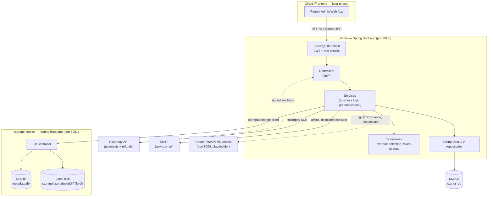
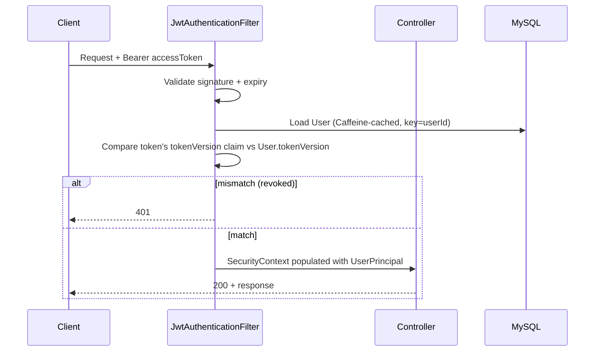
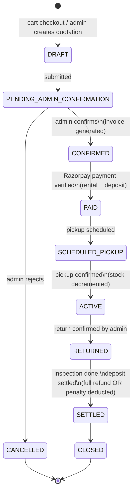
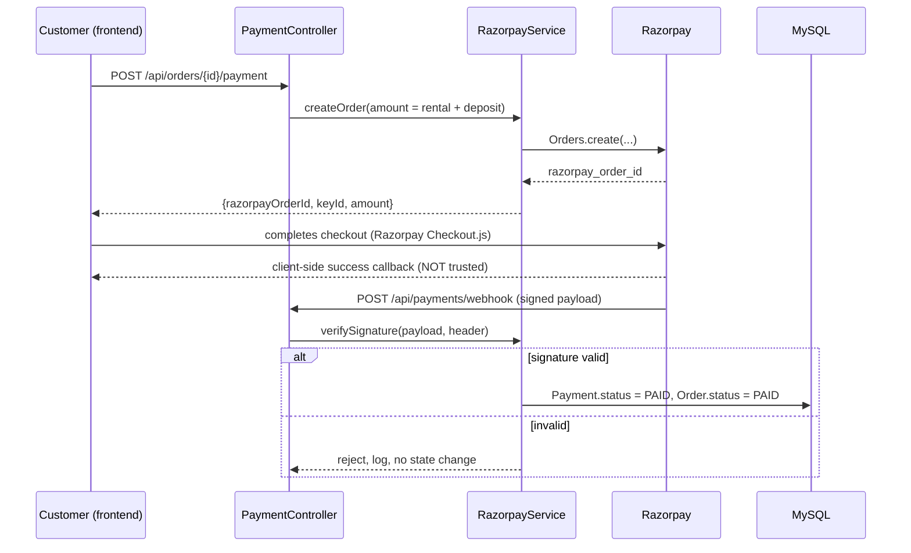

# `<APP_NAME>` — System Design & Architecture

Backend-only system design. Companion to [PRD_README.md](PRD_README.md) (feature decisions) —
this document is the *how*: module layout, request flow, integration architecture, and the full
API surface. DB structure lives in [DB_SCHEMA.md](DB_SCHEMA.md).

---

## 1. High-Level Architecture

Two independently-deployable Spring Boot 4.1.0 apps (unchanged topology from the stub) plus
external services. The rental system is built entirely inside `starter` — `storage-service`
stays a dumb, unauthenticated file store behind it.



**Key properties carried over from the stub, unchanged:**
- Stateless JWT auth (access 45 min / refresh 30 days), revocation via `User.tokenVersion` — no
  session table, no persisted refresh tokens.
- `storage-service` has zero knowledge of `starter`'s users/auth — `starter` always supplies
  `userId` itself and never lets a frontend caller choose whose prefix it writes to.
- Every controller method is authenticated by default; only an explicit, enumerated
  `PUBLIC_ENDPOINTS` list (plus the new Razorpay webhook) bypasses that.
- `ddl-auto=update`, no Flyway — entity annotations are the schema source of truth.

---

## 2. Package Architecture

New code slots into new packages parallel to the stub's existing ones — same layering, same
conventions (constructor injection, SLF4J, `@Transactional` service methods, Jakarta-validated
record DTOs, ModelMapper-backed mappers, `GlobalExceptionHandler`-registered exceptions).

```
com.hackathon.starter
├── controller/
│   ├── AuthController, UserController, AdminController        (existing)
│   ├── StorageController, MlController                        (existing)
│   ├── ProductController, ProductVariantController
│   ├── AttributeController                     — attribute types/values (Brand, Color, Size...)
│   ├── PricelistController
│   ├── RentalPeriodController
│   ├── QuotationController, QuotationTemplateController
│   ├── CartController
│   ├── OrderController                          — the core order lifecycle
│   ├── PaymentController                        — Razorpay order creation + webhook
│   ├── DepositController                        — read-only ledger views
│   ├── PickupController, ReturnController
│   ├── InvoiceController
│   ├── AddressController
│   ├── DashboardController
│   └── RentalSettingsController                 — admin org config
├── service/            (mirrors controller list 1:1, plus internal-only services below)
│   ├── PricingService            — resolves applicable pricelist + price for a line
│   ├── AvailabilityService       — variant stock vs. overlapping-date reservations
│   ├── LateFeeService            — grace period + daily % accrual + cap
│   ├── DepositSettlementService  — the single @Transactional method that closes an order
│   └── RazorpayService           — order creation, webhook verification, refunds
├── repository/          (Spring Data JPA, one per entity)
├── entity/               — see DB_SCHEMA.md
├── dto/request|response/
├── mapper/               (ModelMapper, isolated per-entity like UserMapper)
├── enums/                — OrderStatus, PaymentStatus, DepositTxnType, DurationUnit, etc.
├── exception/            — new custom types, each with a real throw site + a
│                           GlobalExceptionHandler entry (OutOfStockException,
│                           InvalidOrderStateException, PaymentVerificationException, ...)
├── scheduler/
│   ├── TokenCleanupScheduler                    (existing)
│   └── OverdueDetectionScheduler                — flags orders past due, triggers late-fee calc
├── client/
│   ├── MlClient, StorageClient                  (existing, @HttpExchange)
│   └── RazorpayService uses the official SDK directly — no @HttpExchange wrapper (§6.3)
└── security/, logging/, aspect/, config/         (existing, untouched)
```

---

## 3. Security Architecture

### 3.1 Roles

Collapsed to two (see PRD §1): `ADMIN`, `CUSTOMER`. `Role` enum, `SecurityConfig` matchers, and
`RoleController` are updated together at implementation time; `ROLE2..4` placeholder endpoints
are deleted, not left dead.

### 3.2 Authorization matrix

| Path prefix | Public | CUSTOMER | ADMIN |
|---|---|---|---|
| `/api/auth/**` (signup, login, refresh, verify, password reset, oauth2 exchange) | ✅ | ✅ | ✅ |
| `/api/payments/webhook` (Razorpay, signature-verified) | ✅* | — | — |
| `/api/users/me/**`, `/api/addresses/**` | — | own data only | own data only |
| `/api/products/**`, `/api/pricelists/**` (browse, `GET`) | — | ✅ | ✅ |
| `/api/products/**`, `/api/pricelists/**`, `/api/rental-periods/**`, `/api/attributes/**` (write) | — | — | ✅ |
| `/api/cart/**`, `/api/orders/**` (create/view own) | — | own orders only | ✅ (all orders) |
| `/api/orders/{id}/confirm`, `/api/orders/{id}/reject` | — | — | ✅ |
| `/api/quotations/**`, `/api/quotation-templates/**` | — | — | ✅ |
| `/api/pickups/**`, `/api/returns/**` | — | — | ✅ |
| `/api/invoices/{id}` (download) | — | own invoices only | ✅ |
| `/api/dashboard/**` | — | — | ✅ |
| `/api/admin/rental-settings/**` | — | — | ✅ |
| `/api/storage/**`, `/api/ml/**` | — | ✅ (existing behavior) | ✅ |

\* Public in the sense of no JWT — authenticity is instead enforced by Razorpay's HMAC webhook
signature, verified inside the controller before any state change (see §6.3).

"own data only" is enforced the same way `StorageController` already scopes files to
`principal.getId()` — never trust a customer-supplied `userId`/`customerId` in a request body;
always derive it from `@AuthenticationPrincipal UserPrincipal`.

### 3.3 Auth flow (unchanged, reused as-is)



---

## 4. Order Lifecycle — State Machine

Implements PRD §2 (admin-must-confirm-everything).



`DepositSettlementService.settle(orderId)` is the single `@Transactional` boundary that, on
return confirmation, does all of: late-day calculation → `LateFeeService` (compounding formula,
§5.3) → deposit deduction (capped at the deposit's own amount) → Razorpay refund of whatever
remains → stock increment → invoice generation (a `LATE_FEE` invoice, for either the deducted
penalty or, if the penalty exceeds the deposit, the **outstanding** uncovered balance — PRD §7) →
status transition to `SETTLED`. No caller is allowed to do any of these steps individually — this
is what the PRD's "never half-settled" guarantee means concretely.

---

## 5. Availability & Pricing Resolution

### 5.1 Availability check (on add-to-cart and at admin confirmation)

```
available(variantId, startDate, endDate, requestedQty):
    reserved = SUM(orderLine.quantity)
               WHERE orderLine.variantId = variantId
               AND orderLine.order.status IN (CONFIRMED, PAID, SCHEDULED_PICKUP, ACTIVE)
               AND orderLine.startDate < endDate AND orderLine.endDate > startDate   -- overlap
    return (variant.totalQuantity - reserved) >= requestedQty
```
Re-checked at **both** cart-add time (advisory) and admin-confirmation time (authoritative, inside
the same transaction that flips the order to `CONFIRMED` — prevents a race between two admins
confirming overlapping orders).

### 5.2 Pricelist resolution (PRD §5 / Q8)

```
resolvePrice(productVariant, date, durationUnit):
    candidates = pricelists WHERE active
                 AND (validFrom IS NULL OR validFrom <= date)
                 AND (validTo IS NULL OR validTo >= date)
                 AND HAS PricelistItem for (productVariant, durationUnit)
    winner = candidates ORDER BY createdAt ASC LIMIT 1     -- oldest pricelist wins (PRD Q8)
    return winner.item.unitPrice
    fallback: DEFAULT pricelist if no other candidate matches
```

### 5.3 Late fee calculation (PRD §7 / Q6 — compounding, confirmed)

```
calculateLateFee(order, actualReturnDate):
    dueDate = order line's latest endDate
    lateDays = max(0, days(actualReturnDate) - days(dueDate) - settings.gracePeriodDays)
    if lateDays == 0: return {penaltyDeducted: 0, outstanding: 0}

    basePrice = orderLine.product.basePrice
    compoundedFee = basePrice * ((1 + settings.dailyLateFeePercentage) ^ lateDays - 1)
    cappedFee = min(compoundedFee, basePrice * settings.maxLateFeeMultiplier)  -- own cap, not tied to deposit

    penaltyDeducted = min(cappedFee, deposit.amount)
    outstanding = max(0, cappedFee - deposit.amount)   -- PDF §3 "visibility of outstanding penalties"
    return {penaltyDeducted, outstanding}
```

`outstanding > 0` triggers a `LATE_FEE` invoice for that remainder (§9.11) and surfaces on the
admin dashboard's late-fee widget — it is tracked, not auto-collected via a second Razorpay
charge, unless a future decision adds that.

---

## 6. Integration Architecture

### 6.1 storage-service (existing, reused for new asset types)

Used for: product images, profile photos (existing), damage-report photos, generated invoice
PDFs. All go through `StorageClient` → `StorageController`'s existing rewrite pattern — no new
integration code needed, just new callers.

### 6.2 Email (existing, reused)

New template events layered onto the existing async Thymeleaf pipeline: order confirmed, payment
received, pickup reminder, return-due reminder, overdue notice, deposit-refund receipt (final
list per PRD open question #7). Same `@Async`-on-dedicated-executor rule as verification emails —
never block a request thread on SMTP.

### 6.3 Razorpay (new)



Refunds (full on-time, or remainder-after-penalty) go through the same `RazorpayService` calling
Razorpay's Refunds API from `DepositSettlementService`. Official `razorpay-java` SDK used (see
PRD §8) — the one deliberate exception to the stub's `@HttpExchange`-only external-call
convention, justified by needing built-in HMAC webhook verification.

### 6.4 ML service (existing stub, untouched)

`MlClient`/`MlController` remain a placeholder. If any bonus AI feature (availability
forecasting, predictive maintenance) is scaffolded, it's a new method on `MlClient`, not a new
integration pattern.

---

## 7. Cross-Cutting Concerns (all reused unchanged from the stub)

- **Logging:** `RequestLoggingFilter` (correlation id in MDC, echoed as `X-Request-Id`),
  `LoggingAspect` on the service layer, `GlobalExceptionHandler` logs every handled exception.
  New exception types follow the same warn-for-4xx / error-with-stacktrace-for-500 split.
- **Caching:** Caffeine via Spring Cache abstraction for the cached-user lookup (`"users"` cache,
  already evicted on every mutating `UserService` call). No new cache needed for rental data in
  this phase — dashboard aggregates are computed live; revisit only if profiling shows it's
  needed.
- **Rate limiting:** Resilience4j `@RateLimiter`, currently on auth endpoints. Candidate
  additions: `/api/payments/*` (abuse prevention) — flagged as a decision for implementation
  time, not blocking design.
- **Validation:** Jakarta Bean Validation on every request DTO (`@NotNull`, `@Future` for rental
  dates, `@Positive` for quantities/amounts, `@DecimalMin` for percentages) + service-layer
  invariants (start < end, quantity ≤ availability, order state transitions only via the allowed
  edges in §4) thrown as `BadRequestException`/`InvalidOrderStateException`.
- **OpenAPI:** every new controller method carries `@Operation` + full `@ApiResponses` mapped to
  `GlobalExceptionHandler` entries, `@SecurityRequirement(BEARER_SCHEME)` on every authenticated
  controller — same convention as `UserController`/`StorageController`.
- **Money:** `BigDecimal` everywhere monetary, never `double`/`float`.

---

## 8. Scheduled Jobs

| Job | Schedule | Responsibility |
|---|---|---|
| `TokenCleanupScheduler` (existing) | daily 03:00 | purge expired/used `auth_tokens` rows |
| `OverdueDetectionScheduler` (new) | hourly | find `ACTIVE` orders past `endDate + grace period`, mark `OVERDUE` flag, trigger overdue-notice email; does **not** itself settle the deposit — settlement only happens on actual return confirmation (§4) |
| Reminder scheduler (new, if notification events include pickup/return reminders) | daily | scan orders due for pickup/return in next N days, send reminder emails |

---

## 9. Full API Endpoint Catalog

Conventions: all paths under `/api`; `🔒` = authenticated (Bearer JWT); role shown where
narrower than "any authenticated user"; request/response types are the DTO to be created,
following the existing `record` + `@Schema` pattern.

### 9.1 Auth — existing, unchanged

| Method | Path | Auth | Notes |
|---|---|---|---|
| POST | `/auth/signup` | public | rate-limited; `role` must be `CUSTOMER` (ADMIN not self-assignable) |
| POST | `/auth/login` | public | rate-limited |
| POST | `/auth/refresh` | public | token rotation |
| POST | `/auth/logout` | 🔒 | stateless no-op |
| POST | `/auth/logout-all-devices` | 🔒 | bumps `tokenVersion` |
| POST | `/auth/verify` | public | |
| POST | `/auth/resend-verification` | public | rate-limited |
| POST | `/auth/forgot-password` | public | rate-limited |
| POST | `/auth/reset-password` | public | |
| POST | `/auth/oauth2/exchange` | public | dead-but-kept per your instruction; Google OAuth2 not used in this product |

### 9.2 Users & Addresses

| Method | Path | Auth | Notes |
|---|---|---|---|
| GET | `/users/me` | 🔒 | existing |
| PUT | `/users/me/profile` | 🔒 | existing |
| PUT | `/users/me/password` | 🔒 | existing |
| PUT | `/users/me/photo` | 🔒 | new — profile image via `StorageClient`, sets `User.profileImageFileId` |
| GET | `/addresses` | 🔒 | list own addresses |
| POST | `/addresses` | 🔒 | add address |
| PUT | `/addresses/{id}` | 🔒 | update own address (403 if not owner) |
| DELETE | `/addresses/{id}` | 🔒 | remove own address |
| PUT | `/addresses/{id}/default` | 🔒 | mark as default shipping address |

### 9.3 Products, Variants, Attributes

| Method | Path | Auth | Notes |
|---|---|---|---|
| GET | `/products` | 🔒 | browse/search, filter by category/attribute, paginated |
| GET | `/products/{id}` | 🔒 | detail incl. variants + resolved default-pricelist price |
| POST | `/products` | 🔒 ADMIN | create (name, description, category, basePrice, securityDepositAmount) |
| PUT | `/products/{id}` | 🔒 ADMIN | update |
| DELETE | `/products/{id}` | 🔒 ADMIN | soft-delete (`active=false`) — never hard-delete a product referenced by past orders |
| POST | `/products/{id}/images` | 🔒 ADMIN | upload via `StorageClient` |
| GET | `/products/{id}/variants` | 🔒 | list variants + per-variant stock |
| POST | `/products/{id}/variants` | 🔒 ADMIN | create variant (attribute value combo + `totalQuantity`) |
| PUT | `/variants/{id}` | 🔒 ADMIN | update quantity/attributes |
| DELETE | `/variants/{id}` | 🔒 ADMIN | soft-delete |
| GET | `/attributes` | 🔒 ADMIN | list attribute types (Brand, Color, Size, Manufacturer) |
| POST | `/attributes` | 🔒 ADMIN | create attribute type |
| POST | `/attributes/{id}/values` | 🔒 ADMIN | add a value to a type |

### 9.4 Pricelists & Rental Periods

| Method | Path | Auth | Notes |
|---|---|---|---|
| GET | `/pricelists` | 🔒 ADMIN | list all pricelists |
| POST | `/pricelists` | 🔒 ADMIN | create (name, validFrom/To nullable = default/unbounded) |
| PUT | `/pricelists/{id}` | 🔒 ADMIN | update |
| DELETE | `/pricelists/{id}` | 🔒 ADMIN | cannot delete the default pricelist |
| POST | `/pricelists/{id}/items` | 🔒 ADMIN | add price rule (variant/product + durationUnit + unitPrice) |
| DELETE | `/pricelists/{id}/items/{itemId}` | 🔒 ADMIN | remove price rule |
| GET | `/rental-periods` | 🔒 | list period templates (name, durationValue, durationUnit) |
| POST | `/rental-periods` | 🔒 ADMIN | create template |
| PUT | `/rental-periods/{id}` | 🔒 ADMIN | update |
| DELETE | `/rental-periods/{id}` | 🔒 ADMIN | delete |

### 9.5 Quotations (in-store, admin-initiated)

| Method | Path | Auth | Notes |
|---|---|---|---|
| GET | `/quotations` | 🔒 ADMIN | list, filterable by status |
| POST | `/quotations` | 🔒 ADMIN | create for a (possibly new) customer, using a template |
| GET | `/quotations/{id}` | 🔒 ADMIN | detail |
| PUT | `/quotations/{id}` | 🔒 ADMIN | edit lines while `DRAFT`/`SENT` |
| POST | `/quotations/{id}/confirm` | 🔒 ADMIN | converts to a `RentalOrder` in `CONFIRMED` state (skips `PENDING_ADMIN_CONFIRMATION` — it *is* the confirmation) |
| POST | `/quotations/{id}/reject` | 🔒 ADMIN | terminal |
| GET | `/quotation-templates` | 🔒 ADMIN | list |
| POST | `/quotation-templates` | 🔒 ADMIN | create (name, header, footer, default terms) |
| PUT | `/quotation-templates/{id}` | 🔒 ADMIN | update |
| DELETE | `/quotation-templates/{id}` | 🔒 ADMIN | delete |

### 9.6 Cart (portal, self-service)

| Method | Path | Auth | Notes |
|---|---|---|---|
| GET | `/cart` | 🔒 CUSTOMER | current user's cart |
| POST | `/cart/items` | 🔒 CUSTOMER | add line (variant, qty, dates or rentalPeriodId) — advisory availability check |
| PUT | `/cart/items/{id}` | 🔒 CUSTOMER | change qty/dates |
| DELETE | `/cart/items/{id}` | 🔒 CUSTOMER | remove line |
| POST | `/cart/checkout` | 🔒 CUSTOMER | creates `RentalOrder` in `PENDING_ADMIN_CONFIRMATION`, clears cart; body carries fulfillment method (`DELIVERY` + addressId, or `STORE_PICKUP`) |

### 9.7 Orders (the core lifecycle)

| Method | Path | Auth | Notes |
|---|---|---|---|
| GET | `/orders` | 🔒 | customer sees own; admin sees all, filterable by status |
| GET | `/orders/{id}` | 🔒 | own order, or any if admin |
| POST | `/orders/{id}/confirm` | 🔒 ADMIN | `PENDING_ADMIN_CONFIRMATION → CONFIRMED`; authoritative availability re-check; generates invoice |
| POST | `/orders/{id}/reject` | 🔒 ADMIN | `PENDING_ADMIN_CONFIRMATION → CANCELLED`, with reason |
| POST | `/orders/{id}/cancel` | 🔒 | customer can cancel their own order only while `PENDING_ADMIN_CONFIRMATION` |
| POST | `/orders/{id}/payment` | 🔒 CUSTOMER | initiates Razorpay order (§6.3) |

### 9.8 Payments

| Method | Path | Auth | Notes |
|---|---|---|---|
| POST | `/payments/webhook` | public\* | Razorpay signed webhook — `CONFIRMED → PAID` |
| GET | `/orders/{id}/payments` | 🔒 | payment history for an order (own, or any if admin) |

### 9.9 Deposits

| Method | Path | Auth | Notes |
|---|---|---|---|
| GET | `/orders/{id}/deposit` | 🔒 | current deposit status + amount |
| GET | `/orders/{id}/deposit/transactions` | 🔒 | full ledger (HOLD/DEDUCTION/REFUND rows) |

### 9.10 Pickup & Return

| Method | Path | Auth | Notes |
|---|---|---|---|
| GET | `/pickups` | 🔒 ADMIN | daily schedule, filterable by date |
| POST | `/orders/{id}/pickup/schedule` | 🔒 ADMIN | set scheduled pickup date |
| POST | `/orders/{id}/pickup/confirm` | 🔒 ADMIN | `SCHEDULED_PICKUP → ACTIVE`, decrements available stock, checklist payload |
| GET | `/returns` | 🔒 ADMIN | daily return schedule |
| POST | `/orders/{id}/return/confirm` | 🔒 ADMIN | `ACTIVE → RETURNED`; condition notes, damage flag, missing-accessories flag |
| POST | `/orders/{id}/return/settle` | 🔒 ADMIN | triggers `DepositSettlementService` (§4) → `SETTLED → CLOSED` |
| POST | `/orders/{id}/damage-report` | 🔒 ADMIN | attach damage description + estimated cost + photos; feeds settlement |

### 9.11 Invoices

| Method | Path | Auth | Notes |
|---|---|---|---|
| GET | `/orders/{id}/invoices` | 🔒 | list (rental invoice + any late-fee invoice) |
| GET | `/invoices/{id}/download` | 🔒 | own invoice, or any if admin — proxies storage-service like `StorageController` |

### 9.12 Dashboard (admin)

| Method | Path | Auth | Notes |
|---|---|---|---|
| GET | `/dashboard/summary` | 🔒 ADMIN | active rentals, due today, upcoming pickups/returns, overdue count, revenue, deposits held, late-fee collection — one aggregate payload per PRD/PDF §1 |
| GET | `/dashboard/overdue` | 🔒 ADMIN | detail list backing the overdue widget |

### 9.13 Admin Settings

| Method | Path | Auth | Notes |
|---|---|---|---|
| GET | `/admin/rental-settings` | 🔒 ADMIN | current org config |
| PUT | `/admin/rental-settings` | 🔒 ADMIN | update grace period, daily late-fee %, default pickup/return windows |

### 9.14 Existing scaffolding, unchanged

| Method | Path | Auth | Notes |
|---|---|---|---|
| GET/PUT/POST/PATCH | `/storage/**` | 🔒 | existing `StorageController`, reused as-is for every file type above |
| POST | `/ml/predict` | 🔒 | existing placeholder, untouched unless a bonus feature needs it |
| GET | `/admin/ping` | 🔒 ADMIN | existing health-check, kept |

---

## 10. What's Deliberately Not Built

Per PRD open questions still pending your answer, these are named but **not** speced yet — don't
start implementing them until Round 2 questions close:
- Route/sequence planning for pickups, barcode/QR scanning, IoT tracking, predictive maintenance,
  availability forecasting (all `[Bonus]`, PRD §10.6).
- Delivery carrier/route tracking beyond "capture address + mark delivered."
- Multi-tenancy (assumed single-org unless told otherwise).
- Tax/GST line items on invoices (assumed none unless told otherwise).

---

Next: [DB_SCHEMA.md](DB_SCHEMA.md) for the full entity-relationship design backing every table
referenced above.
